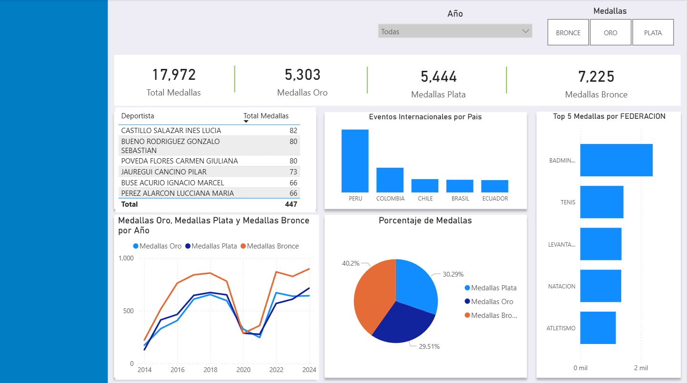

# IPD-Sports-Data-Analysis
¡Bienvenido! En este proyecto realiza un análisis del desempeño de los deportistas peruanos en competencias internacionales, utilizando datos oficiales del Instituto Peruano del Deporte (IPD) mediante la Plataforma Nacional de Datos Abiertos . El objetivo es transformar datos crudos en insights estratégicos sobre el éxito deportivo y la gestión de federaciones.

1. El Problema / Contexto

Los datos del Portal de Datos Abiertos del Gobierno del Perú presentaban desafíos comunes en la gestión de datos reales:

* **Inconsistencia de Formatos**: Fechas con distintos formatos y registros de texto con variaciones de mayúsculas/minúsculas.
* **Dispersión de Información**: Dificultad para visualizar el impacto real de cada deportista dentro de su federación de manera proporcional.
* **Falta de Narrativa Visual**: Los datos tabulares no permitían identificar rápidamente tendencias temporales, como el impacto de la pandemia en el deporte.

2. Solución propuesta 
   
Para resolver esto, implementé un proceso de End-to-End Analytics:

* **Extracción y Limpieza (SQL)**: Utilicé SQL para normalizar la data mediante TRY_CONVERT y LOWER(). Implementé CTEs y Window Functions (PARTITION BY) para calcular el porcentaje de contribución de cada deportista al total de su federación.
* **Visualización (Power BI)**: Diseñé un dashboard interactivo que centraliza los KPIs de medallería (Oro, Plata, Bronce) y permite explorar el rendimiento por año y país de forma dinámica.

3. Insights Principales 
   
* **Resiliencia Deportiva**: Se identificó una recuperación sólida post-pandemia, siendo 2023 un año clave de reactivación competitiva.
* **Distribución de Logros**: El 40.2% de las medallas obtenidas son de bronce, lo que representa una base competitiva amplia con oportunidad de escalamiento hacia el oro (actualmente en 29.5%).
* **Hallazgo**:"El TOP 5 de medallas por federación destaca la hegemonía del Bádminton, lo cual sugiere un modelo de gestión exitoso que podría ser replicado en otras disciplinas"

Liderazgo por Disciplina: Federaciones como Bádminton y Tenis muestran una consistencia superior en el volumen de podios internacionales.

### 🖼️ Dashboard de Rendimiento Deportivo
El dashboard interactivo permite monitorear la evolución de medallería y la eficiencia de las federaciones en tiempo real.

#### 🔍 Análisis de los Componentes Visuales:
* **Evolución Temporal**: El gráfico de líneas muestra claramente el impacto de la pandemia en 2020 y la robusta recuperación en 2023.
* **Distribución de Logros**: El gráfico de torta valida que el **40.2%** de las participaciones resultan en medallas de bronce, seguidas por un **30.29%** de plata y **29.51%** de oro.
* **Dominio por Federación**: Se identifica visualmente a **Bádminton** y **Tenis** como las disciplinas con mayor volumen de podios internacionales.

🛠️ Stack Tecnológico
* **SQL Server**: Procesamiento y lógica de negocio avanzada.

* **Power BI / DAX**: Modelado visual y creación de medidas interactivas.

* **Dataset**: Deportistas en Eventos Internacionales - IPD. 

* **Link**: https://www.datosabiertos.gob.pe/dataset/deportistas-en-eventos-deportivos-internacionales-instituto-peruano-del-deporte-ipd
